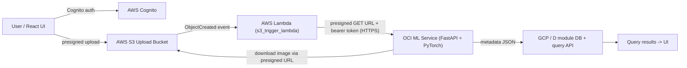

# Route B: ML Inference on Oracle Cloud (OCI)

This is the deployment route where the heavy MegaDetector + SpeciesNet inference runs on
an Oracle Cloud compute instance instead of AWS Lambda. It was chosen because the ML
container is large (PyTorch + two model files) and AWS Academy imposes IAM/role and
container limitations that make a heavy Lambda risky.

## Why this is allowed

The assignment only mandates **AWS Cognito** for authentication. All other services may be
hosted on a secondary cloud (GCP/Azure/Oracle). The "upload triggers a serverless function"
requirement is still satisfied because a lightweight AWS Lambda (`s3_trigger_lambda.py`) is
triggered by the S3 ObjectCreated event; it then forwards the work to the OCI service.

## Multi-cloud data flow



- AWS: Cognito (auth), S3 (storage), API Gateway, lightweight trigger Lambda.
- Oracle (this instance): heavy ML inference service.
- GCP: database + query/notification functions (D module).

## Components

- `ml_service.py`: FastAPI service running on OCI. Loads models once at startup and reuses them.
- `Dockerfile.service`: container image for the OCI service.
- `docker-compose.yml`: run the service with restart policy and health check.
- `aussie-ecolens-ml.service`: systemd unit for auto-start on the OCI VM.
- `s3_trigger_lambda.py`: the small AWS Lambda triggered by S3 that calls this service.

## Security / cross-cloud token passing

All `/v1/*` routes require `Authorization: Bearer <token>`. The token is configured via
`API_AUTH_TOKEN` on the OCI service and `OCI_API_TOKEN` on the AWS trigger Lambda.

For the assignment's "securely pass AWS Cognito tokens to the secondary cloud" requirement,
two options:

1. Shared secret (implemented): the AWS side holds a secret and sends it as the bearer token.
   Simple and reliable for the demo.
2. Cognito JWT pass-through (upgrade path): the trigger Lambda forwards the caller's Cognito
   JWT, and `require_token` in `ml_service.py` is extended to validate the JWT signature
   against the Cognito JWKS endpoint. The validation hook is isolated in `require_token` so
   this change is localised.

Always run the OCI service behind HTTPS (OCI load balancer or a reverse proxy such as Caddy or
nginx with TLS), and restrict the security list / firewall so only the AWS trigger can reach it.

## Run on the OCI instance (Docker)

```bash
cd /home/ubuntu/fit5225/ass2/AussieEcoLense
echo "API_AUTH_TOKEN=$(openssl rand -hex 24)" > .env
# Optional: forward results straight to the D module DB API.
# echo "METADATA_API_URL=https://<d-module-endpoint>/records" >> .env
docker compose up -d --build
curl -s http://localhost:8080/health
```

Enable auto-start on boot:

```bash
sudo cp aussie-ecolens-ml.service /etc/systemd/system/
sudo systemctl daemon-reload
sudo systemctl enable --now aussie-ecolens-ml.service
```

## Run without Docker (venv, used for local verification)

```bash
python3.12 -m venv .venv && source .venv/bin/activate
pip install torch==2.12.0 torchvision==0.27.0 --index-url https://download.pytorch.org/whl/cpu
pip install -r requirements-lambda.txt
pip uninstall -y opencv-python && pip install --force-reinstall --no-deps opencv-python-headless==4.13.0.92
pip install -r requirements-service.txt
API_AUTH_TOKEN=test-token-123 uvicorn ml_service:app --host 0.0.0.0 --port 8080
```

## OCI networking checklist

- Open ingress on the chosen port (e.g. 8080 or 443) in the OCI security list / NSG.
- Open the same port in the instance OS firewall (e.g. `sudo iptables`/`firewalld`/ufw).
- Prefer placing the service behind an OCI Load Balancer with TLS, exposing only 443.
- Lock the source to the AWS Lambda egress (NAT gateway IP) where possible.

## AWS trigger Lambda configuration

Environment variables:

```text
OCI_ML_ENDPOINT=https://<oci-host>/v1/tag/s3
OCI_API_TOKEN=<same value as API_AUTH_TOKEN on OCI>
PRESIGN_EXPIRY=600
REQUEST_TIMEOUT=300
```

IAM permissions: `s3:GetObject` on the upload bucket (to create presigned URLs) and outbound
network access. This Lambda is tiny (only boto3 + stdlib), so a normal zip package works and
avoids the AWS Academy container limitations entirely.

## Verified locally on this OCI instance

See `test_results/route_b_service_test.md`:

- `/health` returns `models_loaded: true`.
- Auth: no token -> 401, bad token -> 403, valid token -> 200.
- `/v1/tag/s3` (presigned-URL flow) returns full metadata, e.g. `Alectura_lathami_1.JPG` ->
  `{ "australian brushturkey": 1 }` at 99.99% confidence.
- `/v1/tag/upload` (query-by-file) returns tags without persisting the file.
