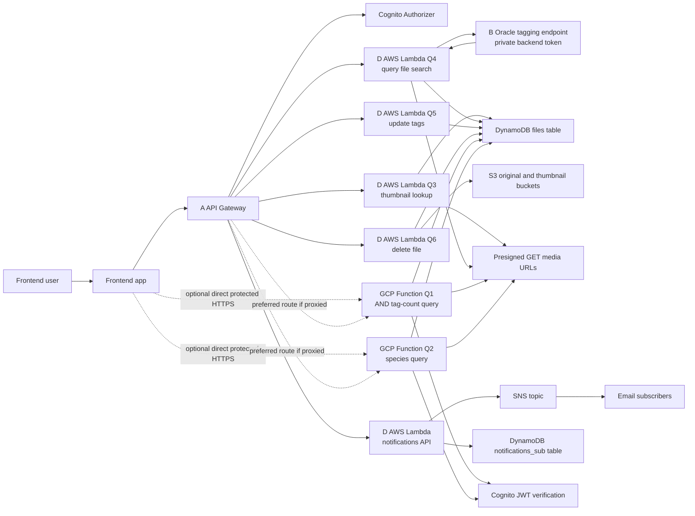

# D group architecture notes

This diagram is a report-ready draft. The final team report can redraw it with
official AWS and GCP icons.

Key boundaries:

- Frontend calls A API Gateway for the formal demo whenever possible.
- D AWS Lambdas are backend handlers behind A API Gateway and Cognito.
- B Oracle token stays private and is used only by backend code.
- GCP Q1/Q2 must verify Cognito JWTs when exposed directly.
- Q1/Q2/Q3/Q4 return short-lived presigned GET URLs for private S3 media.
- Query images for Q4 are not stored in S3 or DynamoDB.
- Notification subscribe saves SNS `subscription_arn`; unsubscribe updates SNS
  filter policy or calls SNS `unsubscribe`.
